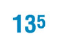
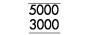
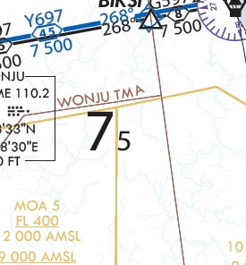
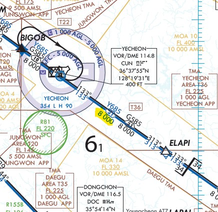

# 비행 중 중 준수하여야 할 고도들 - Altitudes needed to comply with
### FAA와 ICAO, 그리고 대한민국 - FAA, ICAO and Korea Ministry of Land, Infrastructure and Transport
* 한글 버전

비행 중 준수하여야 할 사항들은 아주 많다. 
그중에서도 가장 중요한 것은 ATC의 지시다. 
그러나 그에 못지 않게 규정 고도 역시 중요하다.
IFR 환경에서는 비행 중 단계에서 적절한 장애물 회피와 항법 및 레이더 신호 송수신을 위해, 
VFR 환경에서는 비행 계획 단계에서 최저 장애물 회피 고도의 결정을 위해서 사전 결정된 항공도 상 고도를 참고한다.
(이 게시글에서 비행 규정이나 자세한 비행 방법은 묘사하지 않는다.)

\
참고한 자료는 FAA : Aeronautical Information Manual, FAA 공식 Chart User's Guide(https://www.faa.gov/air_traffic/flight_info/aeronav/digital_products/aero_guide/), 
14 CFR Part 95, ICAO : Official Documents(Doc 8697, Aeronautical Chart Manual & Annex 4 Aeronautical Charts), Korea : Aeronautical Information Manual 입니다.

## FAA 기준
모든 고도 정보는 평균해수면 기준으로 표시됨.
#### Sectional Chart & Terminal Area Chart에 도식되는 고도
1. MEF(Minimum Elevation Figure)\
해당 고도가 명시되어 있는 사각 격자 안의 지형물 중 가장 높은 것의 고도이다. 
구체적인 수치가 아닌 100ft 단위로 명시되어 있으며, 5^1 = 5,100ft, 6^8=6,800ft, 13^5=13,500ft과 같이 해석된다.
이 고도 이상에서 비행한다면, 장애물 회피를 보장받는다.
\
이 수치는 다음과 같은 과정을 통해 결정된다.
(가장 높은 장애물의 평균해수면높이 + 발생 가능한 수직 오차 + 장애물 허용 고도)의 100ft 단위 올림 
\
ex) 13110(가장 높은 장애물의 평균 해수면 높이) + 100(발생 가능한 수직 오차) + 200(장애물 허용 고도) = 13410ft, 이를 100ft 단위로 올림한 13,500ft가 MEF가 되며, 차트에는 19^6(그림 참조)과 같이 표시된다.

#### IFR Low, High Enroute Chart & Area Chart에 도식되는 고도 
1. MEA(Minimum Enroute Altitude)\
Radio Fixes 사이에서 항법 신호의 원할한 수신과 장애물 회피를 보장하는 최저 고도이다. 
전환 구역에서는 최소 300ft, 관제 구역에서는 최소 500ft의 Buffer를 가지도록 설계된다. 
장애물, 항법 시설 성능, 통신 요구 사항을 고려하여 결정한다.
\
GNSS(Global Navigation Satelite System) MEA는 파란색과 접미사 "G"로 표시된다.
\
2. MRA(Minimum Reception Altitude)\
항로와 Fix를 결정하는 항법 시설의 신호 수신을 보장하는 최저 고도이다. 만약 MEA보다 높은 값을 가지게 된다면, MRA 이상에서만 교차점이 정의된다.
항법 시설 혹은 Fix에 표시되며, MRA 지시어와 함께 표시된다.
3. MAA(Maximum Authorized Altitude)\
공역과 항로를 결정하는 데에 사용될 수 있는 최대 고도이다. 이 고도 이하에서 항법에 이용되는 적절한 신호의 수신이 보장된다.
고고도 항공로 항공도에만 표시되며, MEA와 함께 표시되고 MAA 지시어로 구분된다.
4. MOCA(Minimum Obstacle Clearance Altitude)\
장애물 회피와 "VOR" 22NM 반경 내에서 신호 수신을 보장하는 고도이다. 해당 지역의 장애물에 ROC(Required Obstacle Clearance)를 고려하여 결정되거나(1차 지역의 장애물 평가), TERPS 항공도를 이용하여 결정한다.(2차 지역의 장애물 평가)
100ft 단위로 표시되지만, MEF와 다르게 이미 장애물 회피에 대한 평가가 이루어진 고도이기 때문에 반올림한다.
MEA와 함께 표시되며, 고도 앞에 * 표시로써 구분된다.
5. MTA(Minimum Turning Altitude)\
항로상 지점에서 선회 시 장애물 회피를 보장하는 최저 고도이다. 단, 조종사가 항로를 이탈할 것을 예상하여 해당 지점 이전에 선회할 때에만 보장된다.
항공도에서 항법 시설 아래에 **MTA** 지시어 아래에 항로와 고도, 방위 형태로 나타난다.
6. MCA(Minimum Crossing Altitude)\
해당 Fix를 통과해야 하는 최저 고도이다. MEA가 낮은 고도에서 높은 고도로 바뀌는 경우 설정되며, 이 고도 이하로 Fix를 통과하지 않으면 장애물 회피가 보장되지 않는다.
항공도에서 항법 시설 아래에 표시되며, MTA와 같이 다른 고도 제한 사항과 함께 표시될 경우 **MCA** 지시어 아래에 항로와 고도, 방위 형태로 나타난다.

#### MVA, MIA Chart
1. MVA(Minimum Vectoring Altitude)\
IFR 장애물 회피 기준을 만족하는 최저 고도이다. MEA보다 낮을 수 있다. 하지만, 조종사에게 MVA 정보는 항공도 형태로 제공되지 않는다.
2. MIA(Minimum IFR Altitude)\
IFR 항공도에 도식되어 있는 고도를 통해 결정된다. 만약 도식화된 자료가 없다면 비행 경로 좌우측 4NM 범위 내에서 비산악지형의 경우 1,000ft, 산악지형의 경우 2,000ft만큼 자체적으로 회피하여 비행하여야 한다.

#### TPP IAP Chart에 도식되는 고도
1. Restrictive Altitudes\
항공로를 따라 설정되는 고도들이다. 아래 표와 같은 고도들이 설정된다.

| 종류 | 설명 | 예시 |
|---|:---:|---:|
|추천되는 고도|별도의 선 없이 표시되는 고도||
|최저 고도|고도 아래에 실선||
|최대 고도|고도 위에 실선||
|의무 고도|고도 위, 아래에 실선||
|의무 고도 범위|다수의 고도 위, 아래에 실선||
2. MSA(Minimum Safe Altitude)\
특정 Fix 혹은 항법 시설을 중심으로 설정되는 비상 상황에서 이용되는 고도이다. 
반경 25NM 내의 장애물을 평가하며, 1,000ft 이상의 고도로 장애물을 회피하는 것이 보장된다.
상황에서 따라 30NM까지 범위가 확장될 수 있다.
하지만, 항법 신호의 수신은 보장되지 않는다.
유사한 형태로 TAA가 설정된 구역의 항공도에 최저 고도가 표시된다.
3. TAA(Terminal Arrival Areas)\
Plan View 부분에 표시되는 고도로서, 해당하는 접근 시작 구역에 장애물 회피를 위한 최저 고도가 도식된다.

## ICAO & 대한민국 국토교통부 기준
대한민국의 경우 "항공정보 및 항공지도 업무지침" 제3조(적용규정)에 따라 항공지도업무메뉴얼(ICAO Doc 8697)을 준수한다. 
따라서 ICAO Doc 8697을 중심으로 대한민국 항공도 상의 고도제한 혹은 고도참고치를 설명할 것이다.
#### 항공로 항공도에 도식되는 고도
1. AMA(Area Minimum Altitude)\
FAA의 MEF와 유사한 개념의 고도이다. 하지만 MEF가 단순히 사각형 지역 안에서 가장 높은 장애물의 고도를 표시하는 반면,
AMA는 비산악지형의 경우 300m(1,000ft), 산악지형의 경우 600m(2,000ft)의 장애물 회피를 제공하는 고도가 표시된다.
이는 계기 비행 기상에서 이용될 수 있다. 읽는 방법은 MEF와 동일하다. 
\
2^0 = 2,000ft, 12^2 = 12,200ft
\
 
\
따라서 위의 그림 예시의 AMA는 7,500ft 이다.
2. MEA(Minimum Enroute Altitude)\
FAA와 같은 개념으로 사용된다. 하지만 표기 방식이 다르다.
3. MOCA(Minimum Obstacle Clearance Altitude)\
FAA와 같은 개념으로 사용된다. 하지만 표기 방식이 다르다.
4. MSA(Minimum Sector Altitude)\
FAA와 같은 개념으로 사용된다. 표기 방식 역시 동일하며, 장애물 평가 기준과 범위 또한 동일하다.

ICAO 기준으로 발행된 대한민국 항공로 항공도에서 MEA, MOCA는 다음과 같이 표시된다.

\
각 항로명 아래에 적절한 최저 고도가 표시된다.

--------------------
* 영문 버전\
There are many things to comply while flying. Pilots should mainly comply with ATC instructions and restrictions. But, I think altitude restrictions publicated on official charts are important too. 
Under IFR conditions, these are important to avoid ground obstacles as well as to receive appropriate radio signals, and under VFR conditions, altitude restrictions must be considered while planning the entire flight.
(In this article, I will not illustrate detailed flight maneuvers related to altitude restrictions and regulations) Reference publications I used in this article are these. 
FAA : FAA : Aeronautical Information Manual, FAA Official Chart User's Guide(https://www.faa.gov/air_traffic/flight_info/aeronav/digital_products/aero_guide/), 
14 CFR Part 95, ICAO : Official Documents(Doc 8697, Aeronautical Chart Manual & Annex 4 Aeronautical Charts), Korea : Aeronautical Information Manual

## FAA standards
#### Altitudes charted on Sectional & Terminal Area Chart
1. MEF(Maximum Elevation Figure)\

#### Altitudes charted on Low, High Enroute & Area Chart
1. MEA(Minimum Enroute Altitude)\
MEA assures receiving appropriate radio signals and obstacle clearance between radio fixes when the pilot flies above this altitude. MEF is designed to have minimum 300 feet buffer zone in the transition area and minimum 500 feet buffer zone in the control area.
It is determined by obstacles, the performance of navigation aids, and communication requirements.
\
GNSS(Global Navigation Satelite System) MEA is marked with blue color and "G" suffix.
2. MRA(Minimum Reception Altitude)\
MRA assures receiving appropriate navigation aid signals which are related to airways and fixes determined by navigational aids. 
If MRA is higher than MEA, intersections are determined only over MRA.
MRA is determined at navigation facilities and fixes. It is shown with MRA prefix.
3. MAA(Maximum Authorized Altitude)\
Airspaces and airways can be only determined under MAA. This altitude assures receiving appropriate radio signals when the pilot flies under this altitude.
MAA is only determined in High Altitude Enroute Chart.
4. MOCA(Minimum Obstacle Clearance Altitude)\
When the pilot flies over MOCA, obstacle clearance is assured. Plus, within 22 nautical miles from VOR, receiving radio signals is also assured.
Obstacles in primary area is evaluated by ROC(Required Obstacle Clearance) and 
obstacles in secondary area is evaluated by TERPS(U.S. Standard for terminal instrument procedures) aeronautical charts.
MOCA is determined with MEA, and it can be differed with prefix '*'.
5. MTA(Minimum Turning Altitude)\
MTA assures obstacle clearance while turning from fixes or intersections in airways. But, it only assures when the pilot expects route deviation due to turns.
So the pilot must turn earlier than fixes or intersections when deviating routes is expected. It is shown with prefix **MTA**, altitudes, and directions in the eight cardinal directions.
6. MCA(Minimum Crossing Altitude)\
MCA is the lowest altitude that the pilot must comply while crossing the fix. 
When MEA is changed between two fixes or navigation aids, crossing the fix under MCA can make any issues with obstacle clearance.
If MCA is shown with other altitude restrictions like MTA, prefix **MCA** is shown.
 
 #### MVA and MIA Charts
 1. MVA(Minimum Vector Altitude)\
 